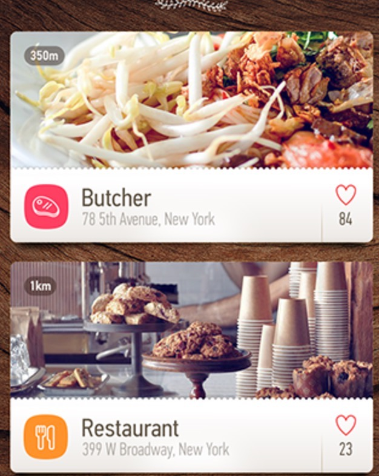

##常用列表布局方案
 
 
 ####中间自适应俩边固定
 
 
 <pre>
 
       <view class="fx-row fx-row-center">
                   <image src="" />
                   <view class="fx-auto">
                       <h3>标题</h3>
                       
内容

                   </view>
                   <view>
                        <button>跳转</buton>
                   </view>
        </view>
 </pre>
 
  ####左右贴头(space-between)
 
 人名,日期 ---- 赞,评论的排序方式
 
  <pre>
        <view class="fx-row fx-row-center fx-row-space-between">
                  <view>
                    <text>邓教授</text>
                    <text>6月13日</text>
                  </view>
                  <view>
                      <text>20赞</text>
                      <text>30评论</text>
                  </view>
         </view>
  </pre>
  
  
   ####双列换行
  
  <pre>
      <view class="fx-row fx-wrap">
                 <view class="gird-50">
                     图片文字...
                 </view>
                 <view class="gird-50">
                     图片文字...
                 </view>
                 <view class="gird-50">
                     图片文字...
                 </view>
             </view>      
  </pre>
  
  
  
   ####横竖组合布局
  
  <pre>
     <view class="fx-column">
                <view class="">
                    图片
                </view>
                <view class="fx-row fx-row-center">
                    <image  src="" />
                    <view class="fx-auto">
                        <text>标题</text>
                        <text>内容</text>
                    </view>
                    <view>
                        84
                    </view>
                </view>
            </view>
  </pre>
  
  
   ####标签云
  
  <pre>
    
     <view class="fx-row fx-row-wrap">
                <view>标签tag</view>
                <view>标签tag</view>
                <view>标签tag</view>
                <view>标签tag</view>
                <view>标签tag</view>
                <view>标签tag</view>
                <view>标签tag</view>
                <view>标签tag</view>
            </view>
  
  </pre>
  
  
   ####栅格布局
  
  
  <pre>
  
         <view class="fx-row">
              <view class="block-1" style="width: 100px;">100px</view>
              <view class="block-2 fx-auto">auto</view>
          </view>
  
          <view class="fx-row">
              <view class="block-1" style="width: 100px;">100px</view>
              <view class="block-2 fx-auto">auto</view>
              <view class="block-1" style="width: 100px;">100px</view>
          </view>
  
          <view class="fx-row">
              <view class="block-2 fx-1">1</view>
              <view class="block-1 fx-3">3</view>
          </view>
  
          <view class="fx-row">
              <view class="block-2 fx-2">1</view>
              <view class="block-1 fx-1">2</view>
          </view>
  
          <view class="fx-row fx-wrap">
              <view class="block-1 gird-33">wrap</view>
              <view class="block-1 gird-33">wrap</view>
              <view class="block-1 gird-33">wrap</view>
              <view class="block-1 gird-33">wrap</view>
              <view class="block-1 gird-33">wrap</view>
              <view class="block-1 gird-33">wrap</view>
          </view>
  </pre>
 
